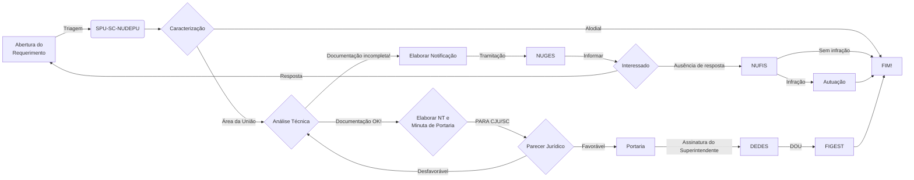

Código:

```mermaid
graph LR
  A[Abertura do <br> Requerimento] -->|Triagem| B(SPU-SC-NUDEPU)
  B --> C{Caracterização}
  C -->|Área da União| D{Análise Técnica}
  C -->|Alodial| F
  D -->|Documentação OK!| E{Elaborar NT e <br> Minuta de Portaria}
  D -->|Documentação incompleta!| M[Elaborar Notificação]
  M -->|Tramitação| N[NUGES]
  N -->|Informar| O{Interessado}
  O -->|Ausência de resposta| P[NUFIS]
  O -->|Resposta| A
  P -->|Infração| Q[Autuação]
  P -->|Sem infração| F
  Q --> F
  E -->|PARA CJU/SC| I{Parecer Jurídico}
  I -->|Favorável| J[Portaria]
  J -->|Assinatura do Superintendente| K[DEDES]
  I -->|Desfavorável| D
  K -->|DOU| L[FIGEST]
  L --> F[FIM!]
```